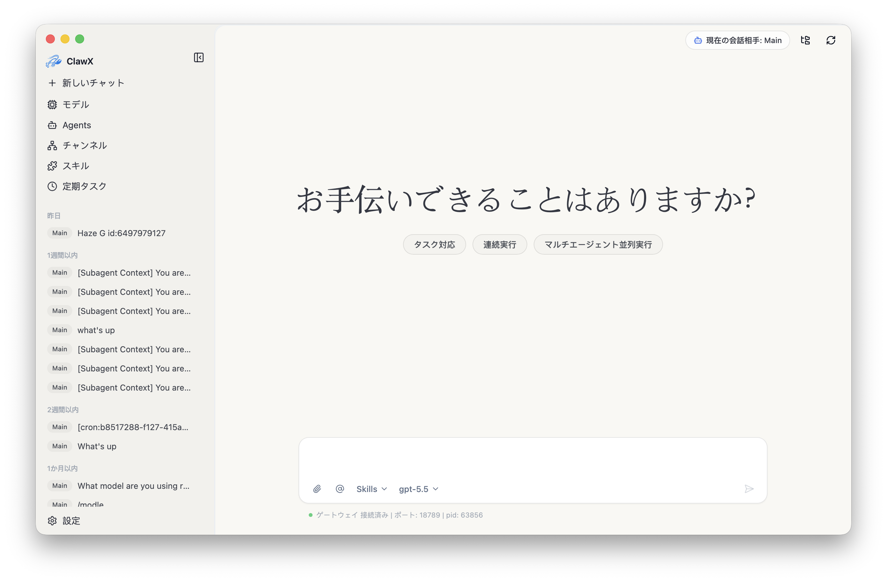
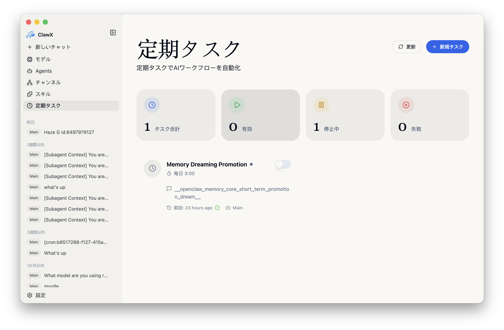
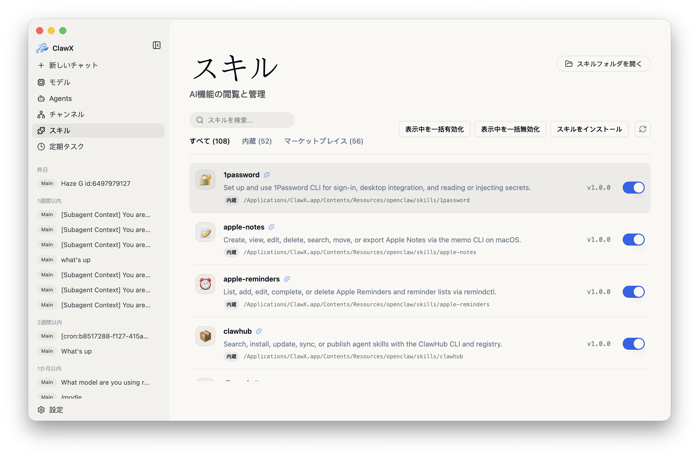
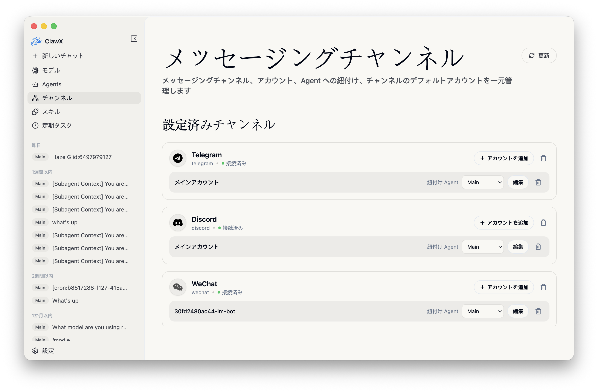
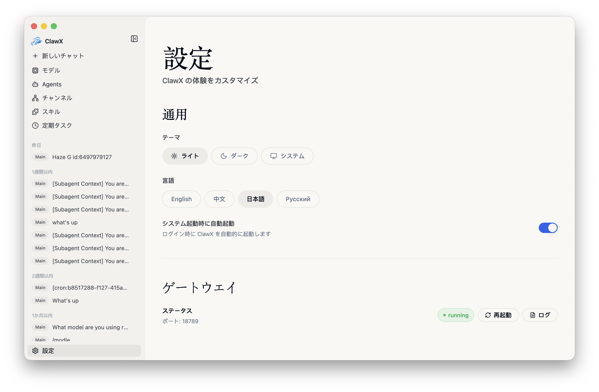

<p align="center">
  
</p>

<h1 align="center">ClawX</h1>

<p align="center">
  <strong>複数のAI Agent Runtimeに共通するデスクトップインターフェース</strong>
</p>

<p align="center">
  <a href="#clawxを選ぶ理由">ClawXを選ぶ理由</a> •
  <a href="#はじめに">はじめに</a> •
  <a href="#アーキテクチャ">アーキテクチャ</a> •
  <a href="#開発">開発</a> •
  <a href="#コントリビューション">コントリビューション</a>
</p>

<p align="center">
  
  
  
  <a href="https://discord.com/invite/84Kex3GGAh" target="_blank">
  
  </a>
  
  
</p>

<p align="center">
  <a href="README.md">English</a> | <a href="README.zh-CN.md">简体中文</a> | 日本語 | <a href="README.ru-RU.md">Русский</a>
</p>

---

## 概要

**ClawX**は、強力なAIエージェントと日常のユーザーとの間のギャップを埋めます。Optionalな[OpenClaw](https://github.com/openclaw/openclaw)と[DeepSeek Harness](https://github.com/deepseek-ai/deepseek-harness) runtimeを、1つの使いやすいデスクトップ体験でhostします。ターミナルは必要ありません。

ワークフローの自動化、AI搭載チャネルの管理、インテリジェントなタスクのスケジューリングなど、ClawXはAIエージェントを効果的に活用するために必要なインターフェースを提供します。

ClawXにはベストプラクティスに基づくモデルプロバイダーがあらかじめ設定されており、Windowsと多言語設定をネイティブにサポートしています。高度な設定は **設定 → 詳細設定 → 開発者モード** から調整できます。

<p align="center"><strong style="font-size:1.1em; text-decoration: underline;">完全なエンタープライズ版、専用サービスサポート、またはビジネスシナリオに合わせた導入支援が必要な場合は、<a href="mailto:public@valuecell.ai">public@valuecell.ai</a> までお問い合わせください。</strong></p>

## スクリーンショット

<table>
  <tr>
    <td align="center"><br><em>チャット</em></td>
    <td align="center"><br><em>スケジュールタスク</em></td>
  </tr>
  <tr>
    <td align="center"><br><em>スキル</em></td>
    <td align="center"><br><em>チャネル</em></td>
  </tr>
  <tr>
    <td align="center"><br><em>モデル</em></td>
    <td align="center"><br><em>設定</em></td>
  </tr>
</table>

## ClawXを選ぶ理由

AIエージェントの構築にコマンドラインの習得は不要であるべきです。ClawXはシンプルな哲学のもとに設計されました：**強力な技術には、あなたの時間を尊重するインターフェースがふさわしい。** 小さなbase appはAgent kernelを含みません。初回にOpenClaw、DeepSeek Harness、両方、または未installを選べます。両runtimeは独立署名・独立更新され、同じClawX UIと1つのlocal historyを使います。

| 課題 | ClawXのソリューション |
|------|----------------------|
| 複雑なCLIセットアップ | ガイド付きセットアップウィザードによるワンクリックインストール |
| 設定ファイル | リアルタイム検証付きのビジュアル設定 |
| プロセス管理 | Kernelごとの独立lifecycle、health、repair、rollback |
| アプリの更新 | 起動時に更新を確認し、ダウンロードまたはインストール前に通知 |
| 複数のAIプロバイダー | 統合プロバイダー設定パネル |
| スキル/プラグインのインストール | オプションの拡張機能マーケットプレイスにも対応したローカル優先のスキル管理 |

### 機能

- **🧠 Optional Multi-Kernel**：OpenClawとDeepSeek Harnessを個別downloadして同時実行できます。一方のcrash/update/rollbackは他方に影響せず、Chat、Agents、Channels、Cron、Skills、historyは同じUIです。
- **🎯 ゼロ設定バリア**：直感的なグラフィカルインターフェースでセットアップを完了できます。ターミナルコマンド、YAMLファイル、環境変数の探索は不要です。
- **💬 インテリジェントチャットインターフェース**：ワークスペース別のグループ化、固定、検索、一括操作に対応した複数セッションの履歴に加え、ACPネイティブのセッション別モデル・推論設定、コンテキスト使用量と手動圧縮、上限付きの可視フォローアップキュー、メッセージのモデル・トークン使用量のホバー表示を提供します。ストリーミングMarkdown、`@agent`ルーティング、インライン`/skill`カード、ドキュメントの読み取り専用プレビューにも対応します。
- **📡 マルチチャネル管理**：複数アカウント、アカウント単位のAgent紐付け、既定アカウントの切り替え、Tencent公式個人WeChatチャネルプラグインを備えた独立したAIチャネルを設定・監視できます。
- **⏰ Cronベースの自動化**：繰り返しまたは1回限りのスケジュールを定義し、スケジュール済みプロンプトにスキルを挿入し、結果を外部チャネルへ配信できます。
- **🧩 拡張可能なスキルシステム**：Gatewayに依存せずスキルをローカルで管理できます。複数のOpenClawソースからスキルを検出し、`pdf`、`xlsx`、`docx`、`pptx` の文書処理スキルも利用できます。
- **🔐 セキュアなプロバイダー統合**：OpenAI、Anthropic、Z.AI / GLMなどに接続し、認証情報をOSのネイティブキーチェーンに安全に保存できます。OAuth、カスタムプロバイダー、互換性フォールバックに加え、モデルごとの思考・画像入力能力を明示し、OpenClawと各Agentのモデルレジストリへ同期できます。
- **🌙 ネイティブ Dreams コンソール**：開発者モードで、Dream フェーズ、シグナル、`DREAMS.md` 日記、Dreaming の有効/無効化、確認付きメンテナンスを扱う OpenClaw メモリダッシュボードを利用でき、上流の `/dreaming` 完全版へも安全に移動できます。
- **🌙 アダプティブテーマ**：ライト、ダーク、システム同期テーマを選択できます。
- **🚀 自動起動設定**：**設定 → 一般** で **システム起動時に自動起動** を有効にできます。
- **🔔 更新通知**：起動時に新しいバージョンを確認し、ダウンロードまたはインストールするかを選択できます。

> 機能の詳細は [docs/ja-JP/features.md](docs/ja-JP/features.md) を参照してください。

### 主なユースケース

- **🤖 パーソナルAIアシスタント**：質問への回答、メールの下書き、ドキュメントの要約、日常タスクの支援を行う汎用AIエージェントを、クリーンなデスクトップインターフェースから設定できます。
- **📊 自動モニタリング**：ニュースフィード、価格、特定のイベントを監視するスケジュールエージェントを設定し、結果を希望する通知チャネルへ届けられます。
- **💻 開発者の生産性向上**：AIを開発ワークフローに統合し、コードレビュー、ドキュメント生成、繰り返しのコーディング作業を行えます。
- **🔄 ワークフロー自動化**：複数のスキルをビジュアルな自動化パイプラインに組み合わせ、データ処理、コンテンツ変換、アクションの実行を行えます。

## はじめに

### システム要件

- **Optional kernel OS**：macOS 13.5以上、Windows 10 x64、またはUbuntu 24.04互換Linux（x64/arm64、glibc 2.39以上、kernel 6.8以上）
- **メモリ**：最低4GB RAM（8GB推奨）
- **ストレージ**：ClawXに1GB、選択runtime用を加えて3GB以上推奨

0.6.0ではLinux musl/AlpineとWindows arm64 runtimeは非対応です。[Support matrix](docs/ja-JP/runtime-security-support.md)を参照してください。

Windowsのoptional runtimeは現在Authenticode署名を延期していますが、Ed25519によるartifact/catalog署名と整合性検証は必須です。macOS runtimeにはDeveloper ID署名とApple公証が必要です。

### インストール

#### ビルド済みリリース（推奨）

[Releases](https://github.com/Tabll/ClawXXX/releases) ページから、お使いのプラットフォーム向けの最新リリースをダウンロードしてください。

#### ソースからビルド

```bash
# リポジトリをクローン
git clone https://github.com/Tabll/ClawXXX.git
cd ClawX

# プロジェクトを初期化
pnpm run init

# 開発モードで起動
pnpm dev
```

### 初回起動

ClawXを初めて起動すると、**セットアップウィザード**が次の手順を案内します。

1. **言語と地域**：使用するロケールを設定
2. **Kernel Catalog**：OpenClaw、DeepSeek Harness、両方、または未installを選択
3. **AIプロバイダー**：ブラウザまたはデバイスログインに対応したプロバイダーでは、APIキーまたはOAuthで追加
4. **スキルバンドル**：一般的なユースケース向けの事前設定スキルを選択
5. **検証**：メインインターフェースに入る前に設定をテスト

サポートされている場合、ウィザードはシステム言語を初期選択し、対応していない場合は英語にフォールバックします。

> Web検索について：ClawXはAgentとGatewayの両方のポリシーレイヤーで、OpenClawの汎用 `web_search` ツールを無効にします。Moonshot（Kimi）検索も対象です。管理対象のブラウザ自動化と `web_fetch` は引き続き利用できます。
>
> 内部ツールについて：ClawXは両方のポリシーレイヤーで、Agentに対して `gateway`、`nodes`、`create_goal`、`get_goal`、`update_goal` も無効にします。ClawXアプリケーション自身のGateway RPCに加え、メッセージング、セッションオーケストレーション、Agent検出ツールは引き続き利用できます。

### プロキシ設定

ClawXのproxy設定はElectron、downloadable runtime traffic、Telegram等のchannelを対象にします。Launch environment変更でrestartするのは影響を受けるinstalled kernelだけで、未install runtimeを起動したり他kernelをrestartしたりしません。

**設定 → Gateway → プロキシ**を開き、既定のプロキシ、バイパスルール、開発者モードでのHTTP・HTTPS・`ALL_PROXY` / SOCKSの上書きを設定します。ローカル設定の例は `http://127.0.0.1:7890` です。

> プロキシのフォールバック動作、Telegramとの同期、**OpenClaw Doctor**については [docs/ja-JP/proxy-settings.md](docs/ja-JP/proxy-settings.md) を参照してください。

## アーキテクチャ

ClawXは **Main-owned multi-kernel + unified Host API architecture**を採用します。React Rendererはcanonical clientだけを呼び、Electron MainがDataService、package verification、kernel supervisors、Scheduler、Channels、Credential Brokerを管理します。

> ClawX 0.6はoptional CI-built OpenClaw/DSHと単一Main-owned SQLite/Blob authorityを実装しています。Protected cross-platform signing、promotion、packaged-test evidenceが不足する場合、public releaseはfail closedです。[設計](docs/zh-CN/multi-kernel-design.md)、[TODO](TODO.md)、[security/support](docs/ja-JP/runtime-security-support.md)、[data policy](docs/ja-JP/data-security-retention.md)を参照してください。

DSH の候補ソースは `0.1.5-rc.2+clawx.14`（プレリリース）です。V3 の system message、Run ごとの persona、append 起点の確定イベントに対応し、モデル文脈の置換による応答・使用量の二重計上を防ぎます。共有 SQLite が唯一の保存先であり、インストール済み runtime の更新には CI artifact の検証・公開が必要です。[今回の互換性設計](harness/reference/kernel-upgrade-2026-09-12.md)。

OpenClaw のソースと開発依存関係は `2026.9.4+clawx.14` です。Discord/WhatsApp も同期し、`.mjs` パッチは容量制限付きメモリ ACP、共有履歴、Main 管理の設定、fail-closed な Channel 受付を維持します。Node は 24.20.0 のままです。候補のローカル検証と未完了のプラットフォーム検証は[今回の設計記録](harness/reference/kernel-upgrade-2026-09-12.md)を参照してください。

両方の +clawx.13 カーネルは Node 24.20.0 を使用し、5 ターゲットの staging 全 25 ジョブ、macOS 公証 4 件（Accepted）、同一ソースの 3 プラットフォーム Electron E2E に合格しました。[CI 検証記録](harness/reference/windows-runtime-ci-repair.md)を参照してください。Windows は artifact 署名のみで、Authenticode は使用しません。本番 catalog の状態、保護された公開の復旧と実配信検証は[公開記録](harness/reference/kernel-automatic-release.md)で追跡し、実アカウント検証は未完了です。

全カーネルのビルドと同一ソース E2E の成功後、本番公開を保護環境へ自動で要求します。COS/GitHub のバージョン付きパッケージは上書きせず、全ターゲットの両ミラー検証後に最新セットの署名 catalog だけを置換します。旧パッケージは参照した全 catalog の有効期限＋24 時間後に安全に削除し、署名監査記録と中断再開を保持します。毎日の保護された保守は artifact/key の期限内で通常 7 日間の catalog を更新しますが、承認は引き続き必要です。初回 bootstrap と実配信の検証は別途必要です。[公開設計](harness/reference/kernel-automatic-release.md)。

catalog 置換後は回数を制限した伝播確認で正確な署名済み版への一致を待ち、最後の厳密な再読込後にのみ削除を許可します。古い版や一時的な欠落を成功とせず、署名 catalog の競合は即座に公開を停止します。

固定 GitHub カーネル資産ページの Pre-release ラベルは、ホスト App の `latest` 検出から除外するためだけに使用します。署名済みカーネル catalog は `production` のままで、バージョン・署名・固定ダウンロード URL は変わりません。

- **プロセスモデル**：Electron Mainがsystem integration、one DataService、Package Manager、kernel別Supervisorを管理します。OpenClawとDSHは並行実行でき、Renderer/runtimeはcanonical ClawX SQLiteを直接開かず相互接続しません。
- **Runtime 検証**：install と再スキャンのファイル検証は最大 8 並列で行い、署名済み hash・size・path の全チェックを維持します。展開ごとに独立した最大 256 件のディレクトリキャッシュで大規模パッケージの処理負荷を抑えます。キャッシュの削除はファイルシステムの再確認を増やすだけで、パス保護を緩和しません。固定されたホストツールのパッチにより、Windows の小さなファイルをメモリマップではなく通常の書き込みで展開し、tar のパス予約と全チェックを維持します。install 済みファイルは read-only とし、保護の設定に失敗した場合は install を拒否します。Windows の atomic なディレクトリ移動では、一時的な `EPERM`/`EBUSY` のみ再試行の待機時間を合計最大 1.5 秒に制限します。永続的なロックは失敗し、コピーや権限緩和で回避しません。clean-machine CI は展開・hash 検証・read-only 化などの所要時間を失敗・timeout 時にも記録します。任意の診断処理が検証結果を変えることはありません。
- **設定の配信**：Gateway実行中は `config.get` / `config.set` を使い、停止中または起動中は解決済みJSON5設定を更新します。通常のプロバイダー、Agent、スキル、モデル変更ではプロセスを置き換えず、認証情報は `secrets.reload` でホットリロードされます。検証済みのGatewayアクティビティが3分間ない場合、ClawXはコアRPCを検証し、自身が所有する利用不能なGatewayプロセスだけを再起動します。外部管理のGatewayは手動で復旧します。
- **統合 Provider**：Provider metadata、model 選択、kernel ごとの default、独立した projection 状態は SQLite の canonical record です。secret は OS の安全な保存領域に残り、preload 所有の closed-shadow field から Main へ一回限りの handle として渡されます。認証済み kernel process は、選択された account と許可済み purpose だけを Credential Broker に要求できます。一方の projection failure が他方の ready projection を rollback することはありません。
- **統合 Skills**：単一の Skills catalog が不変 package metadata、kernel ごとの install/enable intent、互換性、projection diagnostics、retry を管理します。OpenClaw と DeepSeek Harness は相互に独立した物理コピーを使い、root を cross-link しません。Both 操作は partial success を保持して表示します。DSH は隔離された `ctx.skills` adapter だけで互換 instruction body を登録し、未対応の補助ファイルには明確な理由を表示します。
- **統合 Channels**：単一の SQLite catalog が account、kernel/agent binding、owner lease、Conversation mapping、attachment、retry、delivery history を管理し、credential は OS の安全な保存領域にのみ置かれます。OpenClaw は認証済み native handoff adapter、DeepSeek Harness は Main 所有の8種類の connector Relayを使用します。別 account は同時実行でき、同一 account の二重所有や connector-native history は発生しません。
- **統合 Cron**：Main 所有の ClawXScheduler が job、重複しない due admission、run diagnostics、Conversation target、Channel delivery link を SQLite で一元管理します。OpenClaw と DeepSeek Harness の job は同時実行でき、kernel/agent、timezone、misfire、overlap、timeout、Conversation policy を明示します。managed runtime の native scheduler は無効です。OpenClaw の native history 隔離は上記のリリース判定が必要です。
- **統合 Chat**：Chat 履歴、run event、権限、Usage、添付参照はすべて Main 所有の SQLite Conversation Store から読み取ります。ACP と将来の runtime bridge はリアルタイム実行専用です。各イベントは conversation/run/kernel/generation/sequence の完全な識別子を持つため、画面移動中もバックグラウンド stream を保持でき、同じ Conversation を turn 境界で別 kernel に継続できます。runtime transcript fallback は使用しません。
- **統合 Usage と診断**：OpenClaw の provider response と DeepSeek Harness の SessionEvent は、呼び出し単位の冪等な Usage record として同じ SQLite に保存されます。Dashboard は全体/OpenClaw/DSH を比較でき、不明な Token やコストを 0 に変換しません。kernel ごとの診断では正確な artifact、patch revision、protocol、process generation、health、capability を特定でき、永続化・export するログは分離ディレクトリと共通の secret/path redaction を使用します。
- **Dreams**：開発者向けのネイティブ Dreams ページは、型付き Host API 経由で OpenClaw `doctor.memory.*` と保護された `config.patch` のみを呼び出します。認証済み Control UI URL は Electron Main が生成し、Dreams ビューを `/dreaming` へマップするため、Renderer は Gateway へ直接接続しません。
- **設計原則**：フロントエンドの単一入口、Mainによるトランスポート管理、再接続・タイムアウト・バックオフによるグレースフルリカバリ、安全なストレージ、CORSセーフな境界を採用しています。

> プロセス図、設定の調整、ACPファイルアクティビティのセマンティクス、Gatewayのトラブルシューティングについては [docs/ja-JP/architecture.md](docs/ja-JP/architecture.md) を参照してください。

## 開発

`pnpm dev` は初回に固定された独立カーネル Node（24.20.0）を準備します。Gateway・ACP・CLI・Doctor は Electron Helper を使わず、インストール済みカーネルは検証済みパッケージ内の Node を使用します。Electron を直接起動する前に `pnpm run kernel:dev:prepare` を実行してください。ローカルでのダウンロードには独立に検証した本番公開鍵も必要です。[起動・公開鍵の設定](harness/reference/electron-kernel-node-launch.md)を参照してください。

Agent 認証の書き込みは選択したカーネルの SQLite SDK を使用し、ClawX は不完全なネイティブ schema の作成やバージョンの上書きを行いません。既存データの修復はバックアップと隔離コピーでの検証後に実施します。[所有権と修復](harness/reference/openclaw-agent-schema-ownership.md)を参照してください。

開発時も配布アプリも、開発用ディレクトリよりインストール済みカーネルを優先します。停止中の DeepSeek Harness はインストール・修復後すぐに起動できます。OpenClaw の有効化後は ACP/Channels 接続の再構築に ClawX 全体の再起動が必要です。設定では「アプリの再起動」と「ダウンロード済み・有効化待ち」（カーネル停止後に更新）を区別します。[選択と有効化](harness/reference/installed-kernel-activation.md)を参照してください。

### 前提条件

- **Node.js**：対応するメジャー系列の22.22.3以上、24.15.0以上、または25.9.0以上。Node 24.20.0 LTSを推奨し、ダウンロード用runtimeとruntime CIも同版に固定します（module ABI 137）。WindowsではTCP接続時の無言クラッシュがあるNode 24.0–24.15を避けてください。[修正の根拠](harness/reference/windows-runtime-ci-repair.md)。
- **パッケージマネージャー**：pnpm 9以上（npmも対応）
- **Linux（Ubuntu/Debian）**：Electronの実行前に必要なシステムライブラリをインストールしてください。詳細は [docs/ja-JP/development.md](docs/ja-JP/development.md) を参照してください。

### よく使うコマンド

```bash
pnpm run init        # Host依存関係とhost utilityを準備
pnpm dev             # ホットリロード付きで開発モードを起動
pnpm lint            # ESLintを実行
pnpm typecheck       # TypeScriptを検証
pnpm test            # ユニットテストを実行
pnpm run test:e2e    # Electron E2Eスモークテストを実行
pnpm build           # 本番ビルドを実行
pnpm run build:vite  # 拡張 bridge を生成して共有 UI/Electron bundle をビルド
pnpm package         # 現在のプラットフォーム向けにパッケージ化（:mac / :win / :linux）
```

> プロジェクト構成、完全なコマンド一覧、E2Eの並列実行ポリシー、パフォーマンス診断、通信回帰チェック、技術スタックについては [docs/ja-JP/development.md](docs/ja-JP/development.md) を参照してください。

## コントリビューション

コミュニティからの貢献を歓迎します。バグ修正、新機能、ドキュメントの改善、翻訳など、あらゆる貢献がClawXをより良くします。

### 貢献方法

1. リポジトリを**フォーク**する
2. フィーチャーブランチを**作成**する（`git checkout -b feature/amazing-feature`）
3. 明確なメッセージで変更を**コミット**する
4. ブランチに**プッシュ**する
5. **Pull Request**を作成する

### ガイドライン

- 既存のコードスタイル（ESLint + Prettier）に従う
- 新機能にはテストを書く
- 必要に応じてドキュメントを更新する
- コミットはアトミックかつ説明的に保つ

## 謝辞

ClawXは次の優れたオープンソースプロジェクトの上に構築されています。

- [OpenClaw](https://github.com/OpenClaw) - AIエージェントランタイム
- [LobsterAI](https://github.com/netease-youdao/lobsterai) - Gatewayの存活信号と復旧設計の着想元
- [Electron](https://www.electronjs.org/) - クロスプラットフォームデスクトップフレームワーク
- [React](https://react.dev/) - UIコンポーネントライブラリ
- [shadcn/ui](https://ui.shadcn.com/) - 美しく設計されたコンポーネント
- [Zustand](https://github.com/pmndrs/zustand) - 軽量な状態管理

## コミュニティ

コミュニティに参加して、他のユーザーと交流し、サポートを受け、体験を共有しましょう。

| 企業WeChat | Feishuグループ | Discord |
| :---: | :---: | :---: |
|  |  |  |

### ClawXパートナープログラム

ClawXをより多くのお客様、特にカスタムAIエージェントや自動化のニーズを持つお客様に紹介してくださるパートナーを募集しています。

パートナーは見込みユーザーやプロジェクトとの接点づくりを担い、ClawXチームは技術サポート、カスタマイズ、統合を全面的に提供します。AIツールや自動化に関心のあるお客様と仕事をされている方は、ぜひご一緒ください。

詳細はDM、または [public@valuecell.ai](mailto:public@valuecell.ai) までお問い合わせください。

## Star History

<p align="center">
  
</p>

## ライセンス

ClawXは [MITライセンス](LICENSE) のもとで公開されています。本ソフトウェアは自由に使用、変更、配布できます。

<hr>

<p align="center">
  <sub>ValueCell Teamが❤️を込めて開発</sub>
</p>
