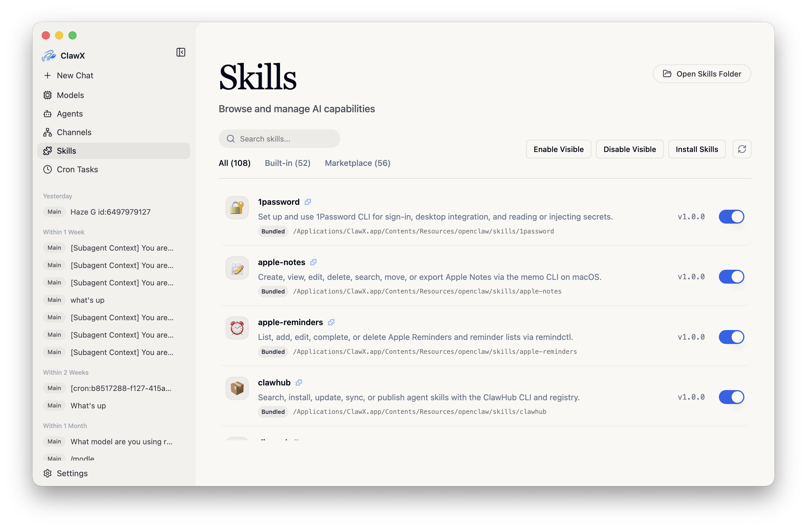
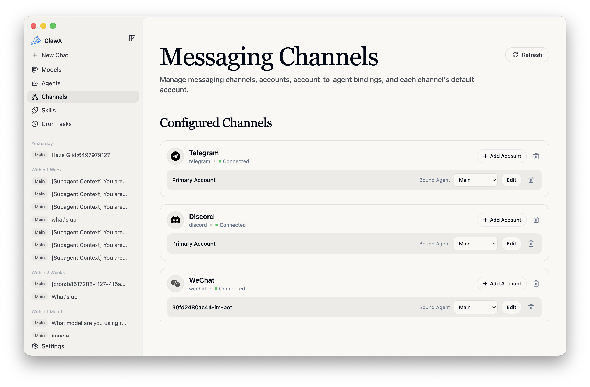
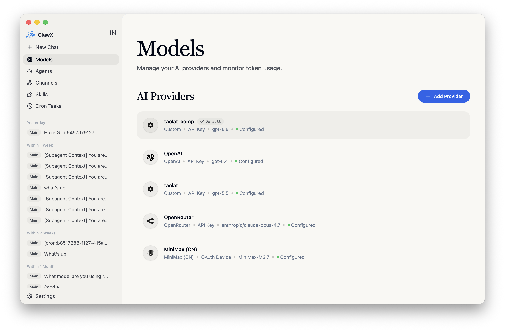
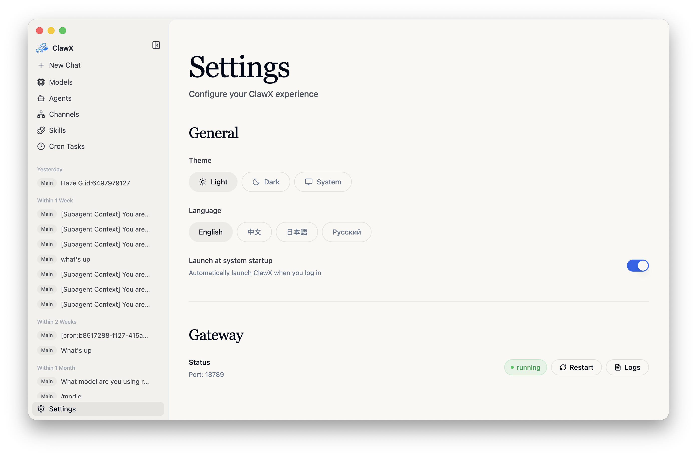

<p align="center">
  
</p>

<h1 align="center">ClawX</h1>

<p align="center">
  <strong>One Desktop Interface for Multiple AI Agent Runtimes</strong>
</p>

<p align="center">
  <a href="#why-clawx">Why ClawX</a> •
  <a href="#getting-started">Getting Started</a> •
  <a href="#architecture">Architecture</a> •
  <a href="#development">Development</a> •
  <a href="#contributing">Contributing</a>
</p>

<p align="center">
  
  
  
  <a href="https://discord.com/invite/84Kex3GGAh" target="_blank">
  
  </a>
  
  
</p>

<p align="center">
  English | <a href="README.zh-CN.md">简体中文</a> | <a href="README.ja-JP.md">日本語</a> | <a href="README.ru-RU.md">Русский</a>
</p>

---

## Overview

**ClawX** bridges the gap between powerful AI agents and everyday users. It hosts optional [OpenClaw](https://github.com/openclaw/openclaw) and [DeepSeek Harness](https://github.com/deepseek-ai/deepseek-harness) runtimes behind one accessible desktop experience—no terminal required.

Whether you're automating workflows, managing AI-powered channels, or scheduling intelligent tasks, ClawX provides the interface you need to harness AI agents effectively.

ClawX comes pre-configured with best-practice model providers and natively supports Windows as well as multi-language settings. You can also fine-tune advanced configurations via **Settings -> Advanced -> Developer Mode**.

<p align="center"><strong style="font-size:1.1em; text-decoration: underline;">For a full enterprise edition, dedicated service support, or tailored deployment guidance for your business scenario, contact us at <a href="mailto:public@valuecell.ai">public@valuecell.ai</a>.</strong></p>

## Screenshots

<table>
  <tr>
    <td align="center"><br><em>Chat</em></td>
    <td align="center"><br><em>Scheduled tasks</em></td>
  </tr>
  <tr>
    <td align="center"><br><em>Skills</em></td>
    <td align="center"><br><em>Channels</em></td>
  </tr>
  <tr>
    <td align="center"><br><em>Models</em></td>
    <td align="center"><br><em>Settings</em></td>
  </tr>
</table>

## Why ClawX

Building AI agents shouldn't require mastering the command line. ClawX was designed with a simple philosophy: **powerful technology deserves an interface that respects your time.** The small base app contains no agent kernel. On first use you can download OpenClaw, DeepSeek Harness, both, or neither as independently signed and updateable runtimes. Both use the same ClawX UI and one canonical local history store.

| Challenge | ClawX Solution |
|-----------|----------------|
| Complex CLI setup | One-click installation with a guided setup wizard |
| Configuration files | Visual settings with real-time validation |
| Process management | Independent lifecycle, health, repair and rollback for every installed kernel |
| App updates | Startup update checks with a prompt before downloading or installing |
| Multiple AI providers | Unified provider configuration panel |
| Skill/plugin installation | Local-first skill management with an optional extension-provided marketplace |

### Features

- **🎯 Zero Configuration Barrier**: Complete setup through an intuitive graphical interface - no terminal commands, YAML files, or environment-variable hunting.
- **💬 Intelligent Chat Interface**: Multi-session context and history with workspace grouping, pinning, search, and batch actions; ACP-native per-session model and reasoning controls, context usage with manual compaction, a visible bounded follow-up queue, and hover details for message model/token usage; plus streaming Markdown, direct `@agent` routing, inline `/skill` cards, and read-only document previews.
- **📡 Multi-Channel Management**: Configure and monitor independent AI channels with multiple accounts, per-account agent binding, default-account switching, and the bundled official Tencent personal WeChat channel plugin.
- **⏰ Cron-Based Automation**: Define recurring or one-time schedules, insert skills into scheduled prompts, and deliver results to external channels.
- **🧩 Extensible Skill System**: Manage skills locally without depending on the Gateway, discover skills from multiple OpenClaw sources, and use bundled document-processing skills for `pdf`, `xlsx`, `docx`, and `pptx`.
- **🔐 Secure Provider Integration**: Connect OpenAI, Anthropic, Z.AI / GLM, and other providers with credentials stored in the native system keychain; supports OAuth, custom providers, compatibility fallbacks, and explicit reasoning/image-input capabilities synchronized to OpenClaw and agent model registries.
- **🌙 Native Dreams Console**: Developer Mode restores a native OpenClaw memory dashboard for dream phases, signals, `DREAMS.md` diary entries, enable/disable controls, and confirmed maintenance actions, with a typed jump to the full upstream `/dreaming` view.
- **🌙 Adaptive Theming**: Choose light mode, dark mode, or system-synchronized themes.
- **🚀 Startup Launch Control**: Enable **Launch at system startup** in **Settings -> General**.
- **🔔 Update Prompts**: Check for new versions at startup and choose whether to download or install them.

> For full feature details, see [docs/en-US/features.md](docs/en-US/features.md).

### Typical Use Cases

- **🤖 Personal AI Assistant**: Configure a general-purpose AI agent to answer questions, draft emails, summarize documents, and help with everyday tasks from a clean desktop interface.
- **📊 Automated Monitoring**: Schedule agents to monitor news feeds, track prices, or watch for specific events, with results delivered to your preferred notification channel.
- **💻 Developer Productivity**: Integrate AI into your development workflow for code review, documentation generation, and repetitive coding tasks.
- **🔄 Workflow Automation**: Chain multiple skills into visual automation pipelines that process data, transform content, and trigger actions.

## Getting Started

### System Requirements

- **Operating System for optional kernels**: macOS 13.5+, Windows 10 x64, or Ubuntu 24.04-compatible Linux (x64/arm64; glibc 2.39+, kernel 6.8+)
- **Memory**: 4GB RAM minimum (8GB recommended)
- **Storage**: 1GB for ClawX plus space for each selected runtime (3GB free recommended)

Linux musl/Alpine and Windows arm64 runtimes are not supported in 0.6.0. See the [support matrix](docs/en-US/runtime-security-support.md).

Windows optional runtimes currently defer Authenticode code signing; Ed25519 artifact/catalog signatures and integrity checks remain required. macOS runtimes require Developer ID signing and Apple notarization.

### Installation

#### Pre-built Releases (Recommended)

Download the latest release for your platform from the [Releases](https://github.com/Tabll/ClawXXX/releases) page.

#### Build from Source

```bash
# Clone the repository
git clone https://github.com/Tabll/ClawXXX.git
cd ClawX

# Initialize the project
pnpm run init

# Start in development mode
pnpm dev
```

### First Launch

When you launch ClawX for the first time, the **Setup Wizard** will guide you through:

1. **Language & Region** - Configure your preferred locale
2. **Kernel Catalog** - Install OpenClaw, DeepSeek Harness, both, or continue without a kernel
3. **AI Provider** - Add providers with API keys or OAuth for providers that support browser or device login
4. **Skill Bundles** - Select pre-configured skills for common use cases
5. **Verification** - Test your configuration before entering the main interface

The wizard preselects your system language when it is supported, and falls back to English otherwise.

> Web search note: ClawX disables OpenClaw's general-purpose `web_search` tool at both the agent and Gateway policy layers. This includes Moonshot (Kimi) search; managed browser automation and `web_fetch` remain available.
>
> Internal tool note: ClawX also disables `gateway`, `nodes`, `create_goal`, `get_goal`, and `update_goal` for agents at both policy layers. Application-owned Gateway RPCs remain available, as do messaging, session orchestration, and agent discovery tools.

### Proxy Settings

ClawX includes built-in proxy settings for Electron, downloadable runtime traffic, and channels such as Telegram. A launch-environment change restarts only the affected installed kernel; it never starts an absent runtime or restarts the other kernel.

Open **Settings -> Gateway -> Proxy** to configure the default proxy, bypass rules, and optional developer-mode overrides for HTTP, HTTPS, and `ALL_PROXY` / SOCKS. A local example is `http://127.0.0.1:7890`.

> For proxy fallback behavior, Telegram synchronization, and **OpenClaw Doctor**, see [docs/en-US/proxy-settings.md](docs/en-US/proxy-settings.md).

## Architecture

ClawX uses a **Main-owned multi-kernel architecture with a unified Host API layer**: the React renderer calls one canonical client abstraction, while Electron Main owns the data service, protocol selection, package verification, supervisors, scheduler, channels and credential broker.

> ClawX 0.6 implements optional CI-built OpenClaw and DeepSeek Harness runtimes backed by one Main-owned SQLite/Blob authority. Public release remains fail-closed until the protected cross-platform signing, promotion and packaged-test evidence in the [implementation checklist](TODO.md) passes. See the [multi-kernel design](docs/zh-CN/multi-kernel-design.md), [runtime security/support](docs/en-US/runtime-security-support.md), and [data policy](docs/en-US/data-security-retention.md).

The reviewed DSH source is now `0.1.3-alpha.1+clawx.11`, with v2 streaming/settlement compatibility and unchanged shared SQLite history. It is still an alpha; upstream reports a performance regression. Source changes do not update an installed runtime until a newly verified CI artifact is published. See the [upgrade contract](harness/reference/deepseek-harness-0.1.3-upgrade.md).

OpenClaw source and development dependencies now use `2026.9.2+clawx.9`. The production bridge creates a fresh in-memory session per Run from canonical SQLite history, translates the new Agents/model/permission configuration, and repairs all seven bundled Channel plugins. Isolated real Gateway/ACP and packaged-payload checks cover tools, cancellation, crash recovery and rejected channel admission without native history writes. Installed runtimes still require a newly verified CI artifact; five-platform signing/publication and real-account acceptance remain pending. See the [upgrade design and evidence](harness/reference/openclaw-2026.9.2-upgrade.md).

- **Process model**: Electron Main owns system integration, one DataService, the package manager and an independent supervisor per kernel. OpenClaw and DSH may run concurrently; the renderer and runtimes never open the canonical ClawX SQLite database or contact each other directly.
- **Configuration delivery**: Main uses `config.get`/`config.set` while the Gateway is running and updates the resolved JSON5 config while it is stopped or starting; ordinary provider, agent, skill, and model changes do not replace the process, and credentials are hot-reloaded through `secrets.reload`. After three minutes without verified Gateway activity, ClawX verifies the core RPC and restarts only an unavailable Gateway process it owns; externally managed Gateways are left for manual recovery.
- **Canonical providers**: Provider metadata, model choices, per-kernel defaults, and independent projection status are canonical SQLite records. Secrets remain in OS-protected storage and move from the preload-owned closed-shadow field to Main as one-time handles; authenticated kernel processes can request only the selected account and authorized purpose through the Credential Broker. A failed projection never rolls back another kernel's ready projection.
- **Canonical Skills**: One Skills catalog owns immutable package metadata, per-kernel install/enable intent, compatibility, projection diagnostics, and retry. OpenClaw and DeepSeek Harness receive independent physical copies—never cross-linked roots—and Both-target operations preserve and report partial success. DSH registers compatible instruction bodies through its isolated `ctx.skills` adapter; unsupported auxiliary packages show an explicit reason.
- **Canonical Channels**: One SQLite catalog owns accounts, kernel/agent bindings, owner leases, message-to-Conversation mappings, attachments, retries, and delivery history. Credentials remain in OS-protected storage. OpenClaw uses an authenticated native handoff adapter; DeepSeek Harness uses the Main-owned eight-connector Relay, and different accounts can run concurrently without dual ownership or connector-native history.
- **Canonical Cron**: Main-owned ClawXScheduler stores jobs, unique due admissions, run diagnostics, Conversation targets, and Channel delivery links in SQLite. OpenClaw and DeepSeek Harness jobs can run together with explicit kernel/agent, timezone, misfire, overlap, timeout, and Conversation policies; managed native schedulers are disabled. OpenClaw native-history isolation remains a release gate as noted above.
- **Canonical Chat**: Chat history, run events, permissions, usage, and attachment references are read from the Main-owned SQLite Conversation Store. ACP and future runtime bridges are live execution transports only. Every live event carries conversation/run/kernel/generation/sequence identity, so navigation can preserve background streams and one Conversation can switch kernels at a turn boundary without a runtime transcript fallback.
- **Canonical Usage and diagnostics**: OpenClaw provider responses and DeepSeek Harness SessionEvents write idempotent per-call Usage records to the same SQLite store. Dashboard filters compare all/OpenClaw/DSH records without converting missing token or cost fields to zero. Per-kernel diagnostics identify the exact artifact, patch revision, protocol, process generation, health and capabilities; persisted/exported logs use isolated directories and shared secret/path redaction.
- **Dreams**: The developer-only native Dreams page uses the typed Host API Gateway RPC path for OpenClaw `doctor.memory.*` and guarded `config.patch` operations. Electron Main owns the authenticated Control UI URL and maps the optional typed Dreams view to `/dreaming`; the renderer never contacts the Gateway directly.
- **Design principles**: One frontend entry point, Main-owned transport, graceful recovery with reconnect/timeout/backoff, secure storage, and CORS-safe boundaries.

> For the process diagram, configuration coordination, ACP file activity semantics, and Gateway troubleshooting, see [docs/en-US/architecture.md](docs/en-US/architecture.md).

## Development

### Prerequisites

- **Node.js**: 22.22.3+, 24.15.0+, or 25.9.0+ within the corresponding supported major line (Node 24 LTS recommended; downloadable runtimes pin their own Node 24.15.0)
- **Package Manager**: pnpm 9+ (npm is also supported)
- **Linux (Ubuntu/Debian)**: Install required system libraries before running Electron; see [docs/en-US/development.md](docs/en-US/development.md)

### Common Commands

```bash
pnpm run init        # Install host dependencies and bundled host utilities
pnpm dev             # Start in development mode with hot reload
pnpm lint            # Run ESLint
pnpm typecheck       # TypeScript validation
pnpm test            # Run unit tests
pnpm run test:e2e    # Run Electron E2E smoke tests
pnpm build           # Full production build
pnpm package         # Package for the current platform (:mac / :win / :linux)
```

> For the project structure, complete command list, E2E parallel policy, performance diagnostics, communication regression checks, and tech stack, see [docs/en-US/development.md](docs/en-US/development.md).

## Contributing

We welcome contributions from the community! Whether it's bug fixes, new features, documentation improvements, or translations, every contribution helps make ClawX better.

### How to Contribute

1. **Fork** the repository
2. **Create** a feature branch (`git checkout -b feature/amazing-feature`)
3. **Commit** your changes with clear messages
4. **Push** to your branch
5. **Open** a Pull Request

### Guidelines

- Follow the existing code style (ESLint + Prettier)
- Write tests for new functionality
- Update documentation as needed
- Keep commits atomic and descriptive

## Acknowledgments

ClawX is built on the shoulders of excellent open-source projects:

- [OpenClaw](https://github.com/OpenClaw) - The AI agent runtime
- [DeepSeek Harness](https://github.com/deepseek-ai/deepseek-harness) - The second optional AI agent runtime
- [LobsterAI](https://github.com/netease-youdao/lobsterai) - Inspiration for Gateway liveness evidence and recovery design
- [Electron](https://www.electronjs.org/) - Cross-platform desktop framework
- [React](https://react.dev/) - UI component library
- [shadcn/ui](https://ui.shadcn.com/) - Beautifully designed components
- [Zustand](https://github.com/pmndrs/zustand) - Lightweight state management

## Community

Join our community to connect with other users, get support, and share your experiences.

| Enterprise WeChat | Feishu Group | Discord |
| :---: | :---: | :---: |
|  |  |  |

### ClawX Partner Program

We're launching the ClawX Partner Program and looking for partners who can help introduce ClawX to more clients, especially those with custom AI agent or automation needs.

Partners help connect us with potential users and projects, while the ClawX team provides full technical support, customization, and integration. If you work with clients interested in AI tools or automation, we'd love to collaborate.

DM us or email [public@valuecell.ai](mailto:public@valuecell.ai) to learn more.

## Star History

<p align="center">
  
</p>

## License

ClawX is released under the [MIT License](LICENSE). You're free to use, modify, and distribute this software.

<hr>

<p align="center">
  <sub>Built with ❤️ by the ValueCell Team</sub>
</p>
