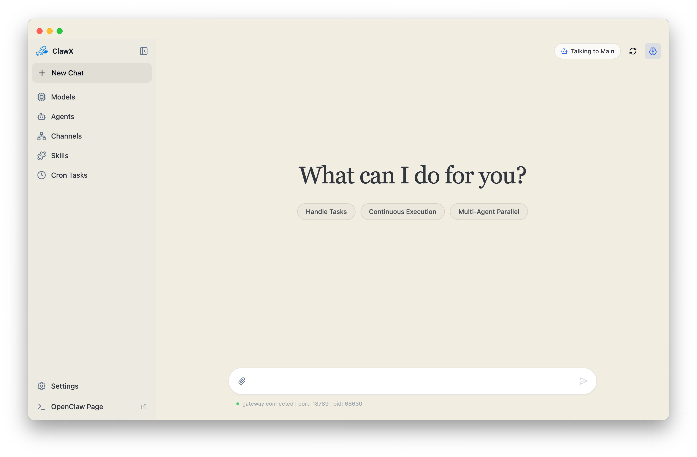
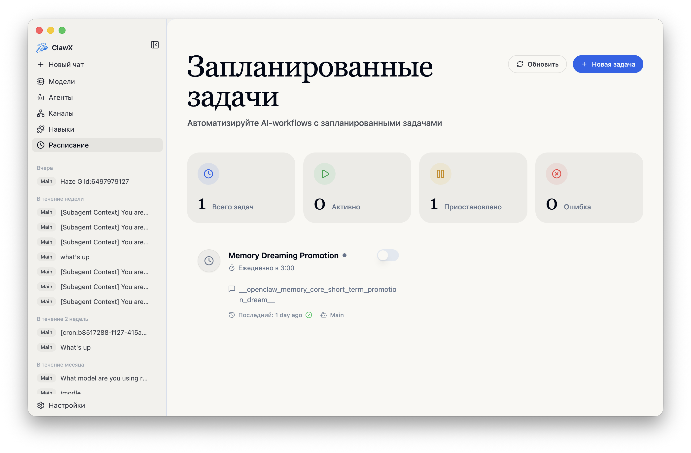
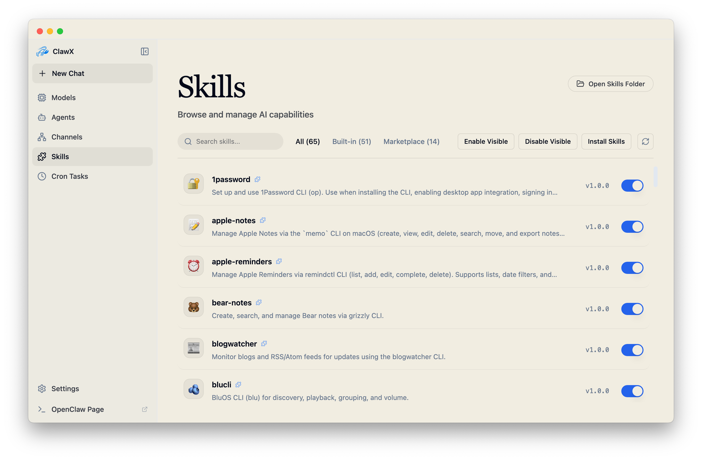
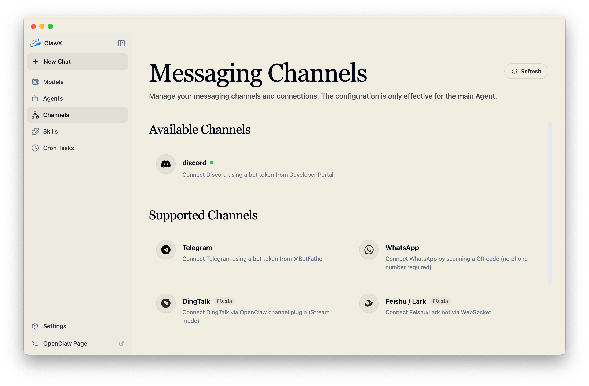
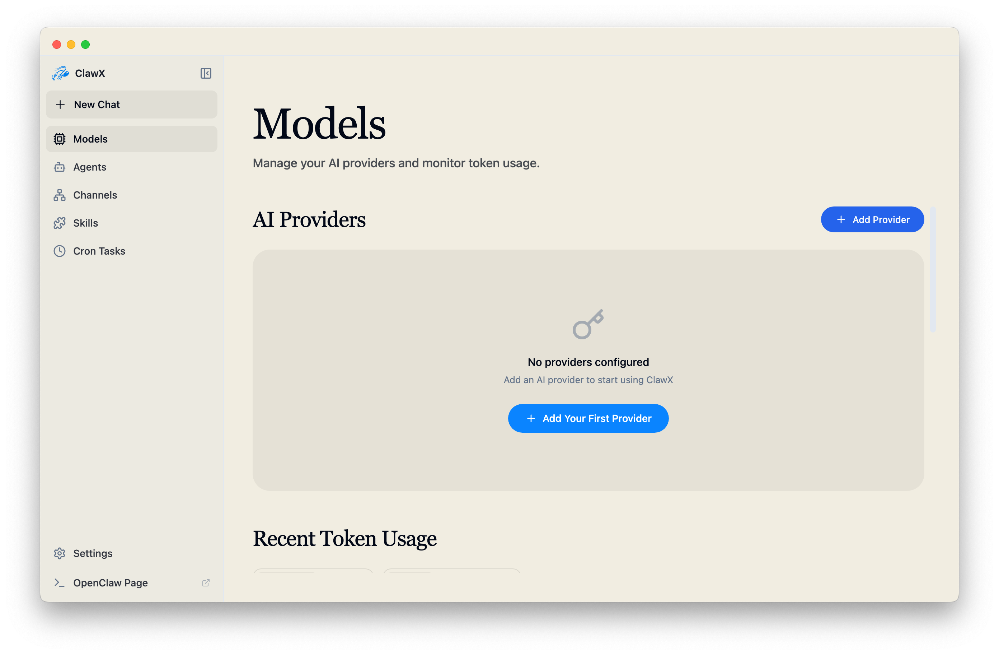

<p align="center">
  
</p>

<h1 align="center">ClawX</h1>

<p align="center">
  <strong>Единый десктоп-интерфейс для нескольких AI runtime</strong>
</p>

<p align="center">
  <a href="#почему-clawx">Почему ClawX</a> •
  <a href="#быстрый-старт">Быстрый старт</a> •
  <a href="#архитектура">Архитектура</a> •
  <a href="#разработка">Разработка</a> •
  <a href="#участие">Участие</a>
</p>

<p align="center">
  
  
  
  <a href="https://discord.com/invite/84Kex3GGAh" target="_blank">
  
  </a>
  
  
</p>

<p align="center">
  <a href="README.md">English</a> | <a href="README.zh-CN.md">简体中文</a> | <a href="README.ja-JP.md">日本語</a> | Русский
</p>

---

## Обзор

**ClawX** — это мост между мощными AI-агентами и повседневными пользователями. Он размещает optional [OpenClaw](https://github.com/openclaw/openclaw) и [DeepSeek Harness](https://github.com/deepseek-ai/deepseek-harness) в одном доступном десктопном интерфейсе — терминал не нужен.

Автоматизация рабочих процессов, управление AI-каналами или планирование интеллектуальных задач — ClawX предоставляет интерфейс для эффективного использования AI-агентов.

ClawX поставляется с предварительно настроенными провайдерами моделей, соответствующими лучшим практикам, и нативно поддерживает Windows и многоязычные настройки. Расширенные параметры можно настроить через **Настройки → Дополнительно → Режим разработчика**.

<p align="center"><strong style="font-size:1.1em; text-decoration: underline;">Для получения полной корпоративной версии, специализированной поддержки или индивидуального сопровождения внедрения под ваш бизнес-сценарий свяжитесь с нами по адресу <a href="mailto:public@valuecell.ai">public@valuecell.ai</a>.</strong></p>

## Скриншоты

<table>
  <tr>
    <td align="center"><br><em>Чат</em></td>
    <td align="center"><br><em>Запланированные задачи</em></td>
  </tr>
  <tr>
    <td align="center"><br><em>Навыки</em></td>
    <td align="center"><br><em>Каналы</em></td>
  </tr>
  <tr>
    <td align="center"><br><em>Модели</em></td>
    <td align="center"><br><em>Настройки</em></td>
  </tr>
</table>

## Почему ClawX

Создание AI-агентов не должно требовать владения командной строкой. Философия ClawX проста: **мощные технологии заслуживают интерфейса, который уважает ваше время.** Base app не содержит ядро: при первом запуске можно скачать OpenClaw, DeepSeek Harness, оба или ни одного. Они независимо подписываются и обновляются, но используют один UI и одну canonical local history.

| Проблема | Решение ClawX |
|----------|---------------|
| Сложная настройка через CLI | Установка в один клик с мастером настройки |
| Конфигурационные файлы | Визуальные настройки с проверкой в реальном времени |
| Управление процессами | Независимые lifecycle, health, repair и rollback каждого kernel |
| Обновления приложения | Проверка обновлений при запуске с запросом перед скачиванием или установкой |
| Несколько AI-провайдеров | Единая панель настройки провайдеров |
| Установка навыков/плагинов | Локальное управление навыками с опциональным маркетплейсом от расширения |

### Возможности

- **🧠 Optional multi-kernel**: OpenClaw и DeepSeek Harness можно загрузить отдельно и запускать одновременно; crash/update/rollback одного не влияет на другой, а Chat, Agents, Channels, Cron, Skills и history используют один UI.
- **🎯 Нулевой порог настройки**: Весь процесс выполняется через интуитивный графический интерфейс — без терминальных команд, YAML-файлов и поиска переменных окружения.
- **💬 Интеллектуальный интерфейс чата**: История нескольких сессий с группировкой по рабочим областям, закреплением, поиском и массовыми действиями; нативные для ACP настройки модели и рассуждений на уровне сессии, индикатор контекста с ручным сжатием, видимая ограниченная очередь последующих сообщений и метаданные модели/токенов при наведении. Также поддерживаются потоковый Markdown, маршрутизация через `@agent`, карточки `/skill` и предпросмотр документов только для чтения.
- **📡 Управление несколькими каналами**: Настраивайте и отслеживайте независимые AI-каналы с несколькими аккаунтами, привязкой агента к аккаунту, переключением аккаунта по умолчанию и встроенным официальным плагином личного WeChat от Tencent.
- **⏰ Автоматизация по расписанию**: Создавайте повторяющиеся или одноразовые расписания, вставляйте навыки в запланированные запросы и доставляйте результаты во внешние каналы.
- **🧩 Расширяемая система навыков**: Управляйте навыками локально без зависимости от Gateway, обнаруживайте навыки из нескольких источников OpenClaw и используйте встроенные навыки обработки документов для `pdf`, `xlsx`, `docx` и `pptx`.
- **🔐 Безопасная интеграция провайдеров**: Подключайте OpenAI, Anthropic, Z.AI / GLM и другие провайдеры; учётные данные хранятся в нативном системном хранилище ключей. Поддерживаются OAuth, пользовательские провайдеры, резервные проверки совместимости и явные возможности рассуждения/ввода изображений с синхронизацией в OpenClaw и реестры моделей агентов.
- **🌙 Нативная консоль Dreams**: В режиме разработчика доступна панель памяти OpenClaw с фазами сна, сигналами, дневником `DREAMS.md`, включением/выключением Dreaming и подтверждаемыми операциями обслуживания; также можно безопасно открыть полную upstream-страницу `/dreaming`.
- **🌙 Адаптивные темы**: Выбирайте светлую, тёмную или синхронизированную с системой тему.
- **🚀 Управление автозапуском**: Включите **Запускать при старте системы** в разделе **Настройки → Общие**.
- **🔔 Уведомления об обновлениях**: Проверяйте новые версии при запуске и сами решайте, скачивать или устанавливать обновление.

> Полное описание возможностей доступно в [docs/ru-RU/features.md](docs/ru-RU/features.md).

### Типичные сценарии использования

- **🤖 Персональный AI-ассистент**: Настройте универсального AI-агента для ответов на вопросы, составления писем, резюмирования документов и помощи с повседневными задачами через чистый десктопный интерфейс.
- **📊 Автоматизированный мониторинг**: Планируйте агентов для отслеживания новостных лент, цен или определённых событий и доставляйте результаты в предпочитаемый канал уведомлений.
- **💻 Производительность разработчика**: Интегрируйте AI в рабочий процесс разработки для проверки кода, генерации документации и автоматизации повторяющихся задач.
- **🔄 Автоматизация рабочих процессов**: Объединяйте несколько навыков в визуальные конвейеры, которые обрабатывают данные, преобразуют контент и запускают действия.

## Быстрый старт

### Системные требования

- **ОС для optional kernels**: macOS 13.5+, Windows 10 x64 или Linux уровня Ubuntu 24.04 (x64/arm64; glibc 2.39+, kernel 6.8+)
- **Память**: минимум 4 ГБ RAM (рекомендуется 8 ГБ)
- **Хранилище**: 1 ГБ для ClawX и место для выбранных runtimes (рекомендуется 3 ГБ)

Linux musl/Alpine и Windows arm64 runtimes не поддерживаются в 0.6.0. См. [матрицу](docs/ru-RU/runtime-security-support.md).

### Установка

#### Готовые релизы (рекомендуется)

Скачайте последний релиз для вашей платформы со страницы [Releases](https://github.com/Tabll/ClawXXX/releases).

#### Сборка из исходников

```bash
# Клонирование репозитория
git clone https://github.com/Tabll/ClawXXX.git
cd ClawX

# Инициализация проекта
pnpm run init

# Запуск в режиме разработки
pnpm dev
```

### Первый запуск

При первом запуске ClawX **Мастер настройки** проведёт вас через следующие шаги:

1. **Язык и регион** — настройка предпочитаемой локали
2. **Kernel Catalog** — установка OpenClaw, DeepSeek Harness, обоих или продолжение без kernel
3. **AI-провайдер** — добавление провайдеров с API-ключами или OAuth для провайдеров, поддерживающих вход через браузер или устройство
4. **Пакеты навыков** — выбор предустановленных навыков для распространённых сценариев
5. **Проверка** — тестирование конфигурации перед входом в основной интерфейс

Мастер предварительно выбирает системный язык, если он поддерживается, иначе переключается на английский.

> Примечание о веб-поиске: ClawX отключает универсальный инструмент OpenClaw `web_search` на уровнях политик агента и Gateway. Это также относится к поиску Moonshot (Kimi); управляемая автоматизация браузера и `web_fetch` остаются доступными.
>
> Примечание о внутренних инструментах: ClawX также отключает для агентов `gateway`, `nodes`, `create_goal`, `get_goal` и `update_goal` на обоих уровнях политик. RPC Gateway самого приложения ClawX, а также инструменты сообщений, оркестрации сессий и обнаружения агентов остаются доступными.

### Настройки прокси

Настройки proxy ClawX охватывают Electron, downloadable runtime traffic и каналы вроде Telegram. Изменение launch environment перезапускает только affected installed kernel, не запускает отсутствующий runtime и не перезапускает другой kernel.

Откройте **Настройки → Gateway → Прокси**, чтобы настроить прокси по умолчанию, правила обхода и дополнительные переопределения HTTP, HTTPS и `ALL_PROXY` / SOCKS в режиме разработчика. Пример локального адреса: `http://127.0.0.1:7890`.

> Подробности о резервном поведении прокси, синхронизации с Telegram и **OpenClaw Doctor** см. в [docs/ru-RU/proxy-settings.md](docs/ru-RU/proxy-settings.md).

## Архитектура

ClawX использует **Main-owned multi-kernel архитектуру и унифицированный Host API**: Renderer знает только canonical client, а Main управляет DataService, package verification, отдельными supervisors, Scheduler, Channels и Credential Broker.

> ClawX 0.6 реализует optional CI-built OpenClaw/DSH и один Main-owned SQLite/Blob authority. Public release fail closed без protected signing/promotion/packaged-test evidence. См. [дизайн](docs/zh-CN/multi-kernel-design.md), [TODO](TODO.md), [security/support](docs/ru-RU/runtime-security-support.md) и [data policy](docs/ru-RU/data-security-retention.md).

- **Модель процессов**: Electron Main управляет системной интеграцией, единственным DataService, Package Manager и отдельным Supervisor каждого kernel. OpenClaw и DSH работают параллельно; Renderer/runtime не открывают SQLite напрямую и не соединяются друг с другом.
- **Доставка конфигурации**: изменения среды выполнения используют авторитетный снимок `config.set`, поэтому обычные изменения провайдера, агента, навыка и модели не заменяют процесс Gateway; учётные данные обновляются без перезапуска через `secrets.reload`, а защищённое восстановление запускается после четырёх последовательных пропусков heartbeat.
- **Canonical Chat**: история Chat, run events, permissions, Usage и attachment references читаются из Main-owned SQLite Conversation Store. ACP и DSH bridges служат только live execution transport. Каждый event несёт conversation/run/kernel/generation/sequence identity, поэтому background stream сохраняется при навигации, а следующий turn того же Conversation можно выполнить другим kernel без runtime transcript fallback.
- **Dreams**: Нативная страница Dreams для разработчиков вызывает OpenClaw `doctor.memory.*` и защищённый `config.patch` только через типизированный Host API. Electron Main создаёт аутентифицированный URL Control UI и сопоставляет Dreams с `/dreaming`; Renderer не обращается к Gateway напрямую.
- **Принципы проектирования**: единая точка входа фронтенда, транспорт под управлением Main, корректное восстановление с переподключением/таймаутом/повтором, безопасное хранение и границы, защищённые от CORS.

> Схема процессов, координация конфигурации, семантика файловых операций ACP и устранение неполадок Gateway описаны в [docs/ru-RU/architecture.md](docs/ru-RU/architecture.md).

## Разработка

### Требования

- **Node.js**: 22.22.3+, 24.15.0+ или 25.9.0+ в пределах соответствующей основной версии (рекомендуется Node 24 LTS)
- **Менеджер пакетов**: pnpm 9+ (npm также поддерживается)
- **Linux (Ubuntu/Debian)**: перед запуском Electron установите необходимые системные библиотеки; см. [docs/ru-RU/development.md](docs/ru-RU/development.md)

### Основные команды

```bash
pnpm run init        # Установить host dependencies и host utilities
pnpm dev             # Запустить режим разработки с горячей перезагрузкой
pnpm lint            # Запустить ESLint
pnpm typecheck       # Проверить типы TypeScript
pnpm test            # Запустить модульные тесты
pnpm run test:e2e    # Запустить дымовые E2E-тесты Electron
pnpm build           # Выполнить полную production-сборку
pnpm package         # Упаковать для текущей платформы (:mac / :win / :linux)
```

> Структура проекта, полный список команд, политика параллельности E2E, диагностика производительности, проверки регрессий коммуникаций и технологический стек описаны в [docs/ru-RU/development.md](docs/ru-RU/development.md).

## Участие

Мы приветствуем вклад сообщества! Исправления ошибок, новые функции, улучшения документации и переводы помогают сделать ClawX лучше.

### Как внести вклад

1. **Сделайте форк** репозитория
2. **Создайте** ветку функции (`git checkout -b feature/amazing-feature`)
3. **Зафиксируйте** изменения с понятными сообщениями
4. **Отправьте** изменения в свою ветку
5. **Откройте** Pull Request

### Руководящие принципы

- Следуйте существующему стилю кода (ESLint + Prettier)
- Пишите тесты для нового функционала
- Обновляйте документацию по мере необходимости
- Держите коммиты атомарными и описательными

## Благодарности

ClawX построен на основе следующих отличных проектов с открытым исходным кодом:

- [OpenClaw](https://github.com/OpenClaw) - Среда выполнения AI-агентов
- [LobsterAI](https://github.com/netease-youdao/lobsterai) - Источник идей для сигналов доступности и восстановления Gateway
- [Electron](https://www.electronjs.org/) - Кроссплатформенный десктоп-фреймворк
- [React](https://react.dev/) - Библиотека UI-компонентов
- [shadcn/ui](https://ui.shadcn.com/) - Красиво спроектированные компоненты
- [Zustand](https://github.com/pmndrs/zustand) - Лёгкое управление состоянием

## Сообщество

Присоединяйтесь к нашему сообществу, чтобы общаться с другими пользователями, получать поддержку и делиться опытом.

| WeChat Enterprise | Группа Feishu | Discord |
| :---: | :---: | :---: |
|  |  |  |

### Партнёрская программа ClawX

Мы запускаем Партнёрскую программу ClawX и ищем партнёров, которые помогут представить ClawX большему числу клиентов, особенно клиентам с потребностями в кастомных AI-агентах или автоматизации.

Партнёры помогают связывать нас с потенциальными пользователями и проектами, а команда ClawX предоставляет полную техническую поддержку, кастомизацию и интеграцию. Если вы работаете с клиентами, заинтересованными в AI-инструментах или автоматизации, мы будем рады сотрудничеству.

Напишите нам в DM или на [public@valuecell.ai](mailto:public@valuecell.ai), чтобы узнать больше.

## История звёзд

<p align="center">
  
</p>

## Лицензия

ClawX выпускается под [лицензией MIT](LICENSE). Вы можете свободно использовать, изменять и распространять это программное обеспечение.

<hr>

<p align="center">
  <sub>Создано с ❤️ командой ValueCell</sub>
</p>
